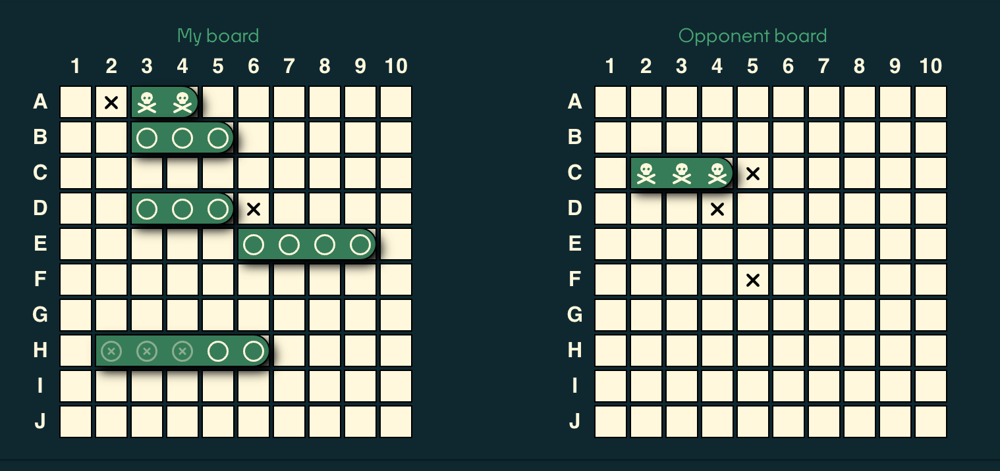
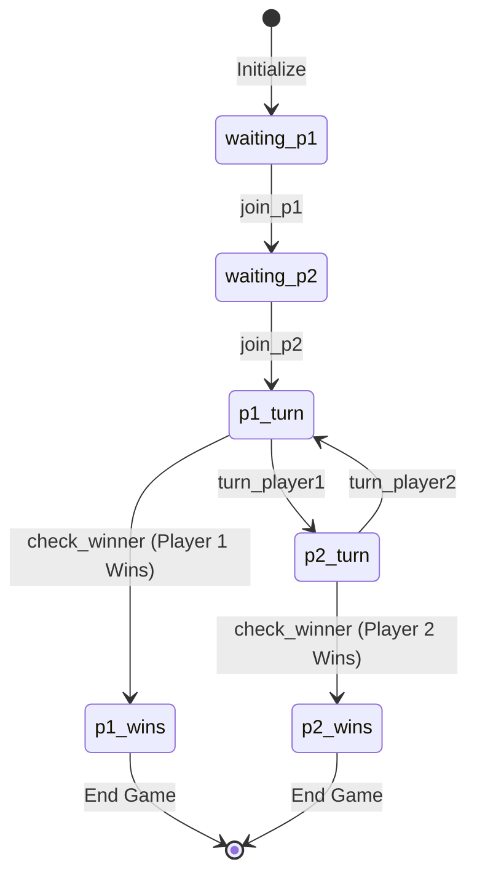
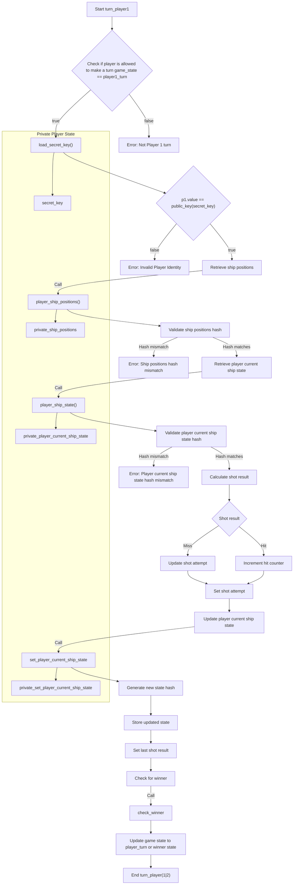

# Brick Towers Sea Battle Game

Welcome to the **Sea Battle** by **Brick Towers** — a classic strategic and
engaging game reimagined with [Midnight](https://midnight.network) blockchain
[Zero Knowledge](https://en.wikipedia.org/wiki/Zero-knowledge_proof) (ZK) capabilities.
This project demonstrates how Midnight's ZK features can ensure a fair game without sharing the secret information with a 3rd party.


## 🕹 Playing the Game
The game is connected to the Midnight TestNet and is available
at https://seabattle.midnight.solutions.

To play, you'll need the latest version of the Chrome browser with the [Midnight Lace Wallet installed](https://docs.midnight.network/develop/tutorial/using/chrome-ext).

To submit game transactions on the Midnight Network, you'll require some
**tDUST tokens** in your Midnight Lace Wallet for transaction fees.
These can be obtained from the [Midnight Network Faucet](https://midnight.network/test-faucet).

To participate in a game, you must add some **tBTC** (Brick Towers Coin) tokens to the prize pool.
The winner of the game will receive the entire prize pool.
You can acquire some test tokens directly on the game page.

## ⚓ Game Overview



The Sea Battle Challenge is a two-player strategy game played on a 10x10 grid.
Each player strategically places five ships of varying lengths on their board.
The objective is to sink all of your opponent’s ships before they sink yours.
Players take turns guessing the coordinates of their opponent's ships.

- A **hit** occurs when a guessed coordinate overlaps with an opponent’s ship coordinate.
- A ship is considered **sunk** when all its coordinates have been hit.
- The game ends when one player has no remaining ships, declaring the other player the victor.

## 📜 Rules of the Game

#### 🌊 Board Setup
- The board consists of a **10x10 grid** with columns labeled **A-J** (Y-axis) and rows numbered **1-10** (X-axis).
- To join a game, each player must contribute **100 Brick Towers Coins (tBTC)** to the prize pool. Tokens are freely available for collection on the game page.
- Each player places **5 ships** on their board. The board layout is stored locally in the player's browser and is never shared with anyone.

Ship lengths:
- 1 ship of length **2** (Destroyer)
- 2 ships of length **3** (Cruiser and Submarine)
- 1 ship of length **4** (Battleship)
- 1 ship of length **5** (Aircraft Carrier)

Ship placement rules:
- Ships must have a uniform width of 1 unit.
- Ships cannot overlap or be placed diagonally.
- Ships can be adjacent but must not overlap.
- Ships cannot be moved once the game begins.

#### ⏳ Gameplay
- Players take turns guessing their opponent's ship coordinates by marking the target location on the board.
  Hits are acknowledged using ZK proofs submitted to the Midnight Network as blockchain transactions.
- A **hit** is registered if the guess corresponds to a coordinate occupied by a ship. The game logic in the browser automatically generates the ZK proof.
- A ship is **sunk** when all its coordinates are hit. This is also acknowledged automatically by the game logic and the player only needs to sign the prompted transaction.

#### 🏆 Winning Condition
- The game ends when one player no longer has any ships, and the other player is declared the winner.
- The losing player must acknowledge the victory by signing and submitting their final turn transaction.
- The winner receives the **prize pool** in their wallet.

## ↩ Alternate Game Variant
This variant, played in Eastern Bloc countries, introduces additional challenges and complexity.
Only the board setup differs, while gameplay and winning conditions remain the same.

> **Note:** This variant is implemented **only as contract code** and is **not exposed in the UI**.

#### 🌊 Board Setup
- The board consists of a **10x10 grid** (same as the Western variant).
- Players place **10 ships** on their board:
  - 1 ship of length **4** (Battleship)
  - 2 ships of length **3** (Cruisers)
  - 3 ships of length **2** (Destroyers)
  - 4 ships of length **1** (Submarines)

Ship placement rules:
- Ships must have a uniform width of 1 unit.
- Ships cannot overlap or be placed diagonally.
- **Ships must not be adjacent** (at least one empty square must separate them).
- Ships cannot be moved once the game begins.

## ✅ Game Features
- 💡 **Fairness**: Enforced by Midnight Network smart contracts written in [Compact](https://docs.midnight.network/learn/glossary#compact), ensuring "can't cheat" rather than "don't cheat."
- 💡 **Privacy**: Ship locations remain in the player's browser and are never shared with a central authority or other players even in an encrypted form.
- 💡 **Infungibility**: Only the wallet owner can make game moves by signing transactions.
- 💡 **Rewards**: Players contribute tBTC to a prize pool, with the winner receiving the full amount at the end of the game.
- 💡 **Observability**: Spectators can track game progress but cannot see hidden ship locations.
- 💡 **Sharing**: Share game links with friends for easy access as a player or a spectator.
- 💡 **Discoverability**: List games awaiting a second player.
- 💡 **Persistence**: Game state is stored locally, allowing players to resume after a browser restart.
- 💡 **Drag-n-drop**: Players can set up the game by dragging and droping ships on their board.
- 💡 **Sounds**: Alerts the player when it is their turn.

## 🛠 Technical Features
- 💡 **Faucet**: Obtain tBTC directly from the game page.
- 💡 **Wallet Feedback**: Detailed feedback on wallet connection status.
- 💡 **Transaction Feedback**: Step-by-step updates during transaction processing.
- 💡 **Error Handling**: Clear error messages for common issues.
- 💡 **Retry Logic**: Resilience against transient failures in public providers.
- 💡 **State Recovery**: Improved state recovery mechanism for transient failures and browser reloads.
- 💡 **Firebase**: Changes to the public game states on blockchain are published to Firebase. This ensures real-time updates of available games.
- 💡 **Indexer**: Indexer is monitoring the blockchain using Midnight indexer and publishes information about relevant (Sea Battle) contracts to Firebase.
- 💡 **Testing**: Comprehensive unit, integration and property-based tests for contract logic and API interactions.


## 📝 Contract Features
- 💡 **State machine**: Model game state transitions as a finite state machine.
- 💡 **Unambiguous data structures**: Accepts board state in a format which allows easy validation.
- 💡 **Unique randomness per game**: Avoids equal hashes for different games with the same board layout.
- 💡 **Single hash of board layout**: Avoids exposing information about hit ships based on ship order in the state.
- 💡 **Store and validate state as witness**: A pattern that ensures that the state is only changed by the contract and is not tampered with by the player during the game.
- 💡 **Overlap check**: Ensures that the board is setup according to the game rules.
- 💡 **Adjacency check**: Advanced check for the Eastern variant to ensure that ships are not adjacent.
- 💡 **Hit check**: Checks if the player hit a ship and updates the state accordingly.
- 💡 **Sunk check**: Checks if the player has hit all the cells of a ship and thus has sunk it.
- 💡 **End game check**: Checks that the game is over based on number of unique cell hits.
- 💡 **Modularization**: Separate contract for each game variant with a shared library for common logic.
- 💡 **Prize Money**: Locks the prize money at the beginning of the game, and sends it to the winner at the end of the game.
- 💡 **Avoid ledger operations in code branches**: Maximising for pure circuits and pushing the side effects to the top level code branches improves proof sizes and performance.

## 🚫 Unimplemented Features
- 💡 Penalizing players who fail to take their turn within a specific timeframe (e.g., 1 day).
  > This requires time-awareness in Midnight contracts, which is currently unavailable.

## 🎨 Game Software Design
The solution is designed to optimize functionality and user experience
while leveraging the current capabilities of the Midnight Network ecosystem.
Its goal is to identify and highlight limitations that the Midnight team
must address to support widespread adoption in real-world applications.

Our focus areas include:
- **End-to-end game functionality** - ensure a complete and engaging user journey.
- **Robust data privacy** - ensure that player data is secure and not exposed to unauthorized parties.
- **A seamless user experience** - ensure that the game is intuitive, easy to understand, and requires minimal prior knowledge to play.

### Modules
The repository contains the following modules:

1. **`battleship-contract-commons`**: Shared contract code used by both game variants.
2. **`battleship-east-contract`**: Eastern variant contract implementation.
3. **`battleship-west-contract`**: Western variant contract implementation.
4. **`battleship-api`**: API for interacting with the Western variant contract.
5. **`battleship-indexer`**: Blockchain public ledger indexer for game discover.
6. **`battleship-ui`**: User interface for gameplay.

### State Transitions
Game state transitions are illustrated below:



### Player Turn Flow
The logic


## 🪛 Build
```
yarn install
npx turbo build
```

## 🧪 Test
```
npx turbo test
```

## 💻 Run locally on standalone network

### Configure the network
Update "NETWORK_ID" in battleship-ui/public/config.json
```
...
  "NETWORK_ID": "Undeployed",
...
```
### Run the server
```shell
npm run battleship-ui
```

### Run the network
```shell
docker compose -f undeployed-compose.yml up
```

### Switch to "Undeployed" network in Lace wallet

Go to **Settings** → **Networks** → Change to **Undeployed**.

### Prepare local standalone environment

* Copy your wallet address from Lace wallet
* Paste it to
  * [prepare-local-standalone-env.test.ts](battleship-api/src/test/prepare-local-standalone-env.test.ts)
* Run the test:
```shell
cd battleship-api
yarn run prepare-local-env
```
* Note deployed tBTC token contract and configure it as `BRICK_TOWERS_TOKEN_ADDRESS` in [config.json](battleship-ui/public/config.json)

## ✍ Hackathon Notes
The game was implemented as part of [Sea Battle Challenge Midnight Virtual Hackathon](https://midnight.brightidea.com/seabattle).
The technical challenges we faced and workarounds implemented are described [here](docs/hackaton_notes.md).
